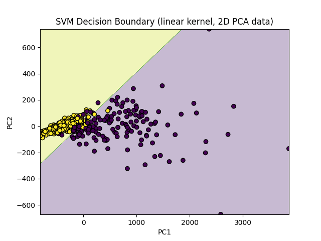
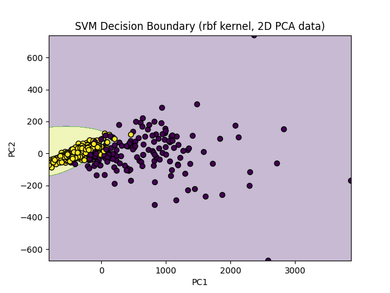

Breast Cancer Classification with SVM
📌 Overview
This project uses Support Vector Machines (SVMs) to classify breast cancer tumors as malignant or benign based on the Wisconsin Breast Cancer Dataset.
It compares Linear and RBF kernels, visualizes decision boundaries in 2D using PCA, tunes hyperparameters (C and gamma), and evaluates model performance with cross-validation.

⚙️ Tools & Libraries
Python
Scikit-learn
NumPy
Matplotlib

🛠 Steps Implemented
Load & Prepare Data
Used scikit-learn’s built-in load_breast_cancer() dataset.
Split into training and testing sets with stratification.
Train SVM Models
Linear 
RBF kernel
2D Visualization (PCA)
Reduced data to 2 principal components for visualization.
Plotted decision boundaries for Linear and RBF SVMs.
Hyperparameter Tuning
Used GridSearchCV to find the best C and gamma for RBF kernel.
Cross-Validation
Compared performance of linear and tuned RBF kernels.

📊 Results
Best RBF Parameters:

{'svc__C': 100, 'svc__gamma': 0.001}

Cross-Validation Accuracy:

RBF (best): 0.986

Linear: 0.984 ± 0.012

Test Accuracy (RBF):

0.958

Confusion Matrix:

 [[48  5]
 
 [ 1 89]]

Classification Report:
          precision    recall  f1-score   support
malignant 0.98 0.91 0.94 53
benign 0.95 0.99 0.97 90
accuracy                           0.96       143
macro avg 0.96 0.95 0.95 143
weighted avg 0.96 0.96 0.96 143

📈 Decision Boundary Visualizations

Linear Kernel (PCA 2D)

RBF Kernel (PCA 2D)

🚀 How to Run
pip install numpy matplotlib scikit-learn
python task7.py

📌 Objective
Use SVMs for both linear and non-linear classification on breast cancer data, compare results, and visualize decision boundaries.
